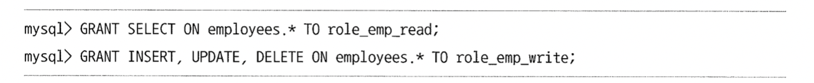

# 3. 사용자 및 권한

mysql 의 사용자 계정은 사용자 아이디 + 어느 IP 접속하고 있는지도 확인한다.

8.0 부터는 Role 개념이 도입되어 권한을 묶어서 관리할 수 있다.

## 3.1 사용자 식별

계정은 아이디 + IP 가 계정으로 구성된다. (`chulhee@127.0.0.1`)

> DB 서버는 private subnet 에 넣어두고, bastion 서버 IP 만 접속할 수 있는 계정을 뚫어놓겠지?

## 3.2 사용자 계정 관리

### 3.2.1 시스템 계정과 일반 계정

시스템 계정과 일반 계정은 SYSTEM_USER 권한 유무에 따라 구분된다.

- 계정 관리
- 다른 세션 또는 그 세션에서 실행 중인 쿼리 강제 종료
- 스토어드 프로그램 생성 시 DEFINDER 를 타 사용자로 설정

등의 작업은 시스템 계정만 가능.

### 3.2.2 계정 생성

- CREATE USER : 계정 생성
- GRANT : 권한 부여

- IDENTIFIED WITH
  - 사용자 인증방식과 비밀번호 설정
- REQUIRE
  - MySQL 서버 접속할 때 암호화된 SSL/TLS 채널을 사용할지 여부 설정 가능.
- PASSWORD EXPIRE
  - 비밀번호 유효기간
- PASSWORD HISTORY 
  - 비밀번호 재사용 금지
- PASSWORD REUSE INTERVAL 
  - 재사용 금지 기간
- PASSWORD REQUIRE
  - 이전 비밀번호 필요로 할지
- ACCOUNT LOCK
  - 계정 생성 혹은 ALTER USER 통해 계정 정보 변경할 때 사용하지 못하게 잠글지 여부

(3.3 스킵)

## 3.4 권한

~5.7 버전까지는 글로벌 권한과 객체 단위의 권한으로 구분된다.

- 글로벌 권한 

  - 데이터베이스나 테이블 이외의 객체에 적용되는 권한
  - GRANT 명령에서 객체를 명시하지 말아야한다.

- 객체 권한

  - 데이터베이스나 테이블을 제어하는 데 필요한 권한
  - GRANT 명령에서 객체를 명시해야 한다

- 동적권한(8.0버전 이상)

  - MySQL 서버가 시작되면서 동적으로 생성하는 권한

  

예외) ALL 권한은 글로벌과 객체 2가지 용도로 모두 사용될 수 있으며, 각 권한의 모든 권한을 부여한다.

## 3.5 역할(Role)

Role 에 GRANT 로 실질적인 권한을 부여하면 된다.

> read 만 하는 계정과 write 가능한 계정을 분리 가능