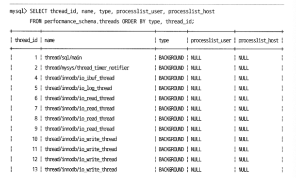

# 4. 아키텍처

## 4.1 MySQL 엔진 아키텍처

MySQL 은 다른 DBMS 에 비해 구조가 독특하다.

- **MySQL 서버** 
  - MySQL 엔진 / 스토리지 엔진 2개로 구분할 수 있다.

- **MySQL 엔진**

  - 이는 클라이언트로부터의 접속 및 쿼리 요청을 처리하는 커넥션 핸들러와 SQL 파서 및 전처리기, 옵티마이저가 중심을 이룸

  - 표준 SQL 문법을 지원하기에 타 DBMS 와 호환 가능

- **스토리지 엔진**
  - MySQL 엔진은 요청된 sql 문을 분석하거나 최적화의 역할을 한다면, 실제 데이터의 저장, 읽는 부분은 스토리지 엔진이 전담
  - MySQL 서버에서 MySQL엔진은 하나지만, 스토리지 엔진은 여러 개를 동시에 사용할 수 있다.
  - `CREATE TABLE test_table(~~) ENGINE=INNODB`
    - 위와 같이 테이블이 사용할 스토리지 엔진을 지정하면 해당 테이블의 모든 읽기 및 변경 작업은 스토리지 엔진이 처리
- **핸들러 API**
  - MySQL 엔진의 쿼리 실행기에서 데이터를 쓰거나 읽을 때 스토리지 엔진에 각 연산에 대해 핸들러 요청을 한다. 
    이 때 사용되는 API.
  - 

### MySQL 스레딩 구조

MySQL 서버는 프로세스가 아닌 스레드 기반으로 동작.

실행중인 스레드의 목록은 performance_schema 데이터베이스의 threads 테이블을 통해 확인 가능

사용자의 요청을 처리하는 foreground 스레드는 `thread/sql/one_connection` 만 해당한다.

같은 이름의 스레드가 여러 개 있을 수 있는데, 이것은 MySQL 서버의 설정 내용에 의해 여러 스레드가 동일작업을 병렬로 처리하는 것. 

#### 포그라운드 스레드 (클라이언트 스레드)

이 스레드는 최소한 MySQL 서버에 접속된 클라이언트 수만큼 존재. 

클라이언트 사용자가 작업을 마치고 커넥션을 종료하면 해당 커넥션을 담당하던 스레드는 스레드 캐시로 돌아간다.

> 어플리케이션 서버에서 쿼리할 때마다 커넥션을 맺으면 고비용의 작업! 커넥션 풀로 미리 커넥션 맺어두고 사용한다.

포그라운드 스레드는 데이터를 MySQL 의 데이터 버퍼나 캐시, 없으면 디스크나 인덱스에서 읽어온다.

InnoDB테이블은 데이터버퍼나 캐시까지만 포그라운드 스레드가, 나머지 버퍼로부터 디스크까지 기록하는 작업은 백그라운드 스레드가 처리한다.

> 궁금증. 그러면 예를 들어 insert 연산 시 버퍼와 캐시까지 포그라운드에서 처리하고, 이후 작업을 위해 백그라운드로 스위치되는건가?

> MyISAM vs INNO DB
>
> 트랜잭션 처리가 필요하고 대용량의 데이터를 다루기 위해서는 InnoDB가 효율적이고, 
> 반면 트랜잭션 처리가 필요없고 운영에 Read only 기능이 많은 서비스일수록 MyISAM 엔진이 효율적이다.

#### 백그라운드 스레드

InnoDB 같은 경우 여러 작업이 백그라운드에서 처리된다.

- 인서트 버퍼 병합하는 스레드
- **로그를 디스크로 기록하는 스레드**
- **Inno DB 버퍼 풀의 데이터를 디스크에 기록하는 스레드**
- 데이터를 버퍼로 읽어 오는 스레드
- 잠금이나 데드락을 모니터링하는 스레드

사용자 요청을 처리하는 도중 쓰기 작업은 지연될 수 있지만, 읽기 작업은 지연될 수 없다. 
따라서 DBMS 대부분(InnoDB 포함)은 쓰기작업을 버퍼링해서 일괄 처리하는 방식으로 되어있다. 

### 4.1.3 메모리 할당 및 사용 구조

메모리 공간은 크게 글로벌과 로컬 메모리 영역으로 구분 가능

- 글로벌 메모리 영역
  - 클라이언트 스레드 수와 무관하게 하나의 메모리 공간만 할당 (2개 이상도 가능하지만 클라이언트 스레드 수와 무관 + 모든 스레드에 의해 공유됨)
  - 예시는 위의 이미지 참조
- 로컬 메모리 영역(세션 메모리 영역)
  - **클라이언트 스레드가 쿼리를 처리하는 데 사용하는 메모리 영역**
    - 커넥션 버퍼, 정렬 버퍼 등이 여기 존재!
  - 클라이언트가 MySQL 서버에서 커넥션당 하나의 스레드를 할당한다.
  - 세션 - 클라이언트와 MySQL 서버와 커넥션을 세션이라고도 표현
  - 글로벌 메모리 영역에 비해 크게 신경쓰지 않고 메모리 크기를 설정하는 편이지만 메모리 부족 주의
  - 각 쿼리의 용도별로 필요할 때만 공간이 할당, 그렇지 않을 때는 할당하지 않음
    - 소트나 조인 버퍼가 이에 해당
    - 커넥션/결과 버퍼는 계속 할당된 상태로 남아있고 소트/조인 버퍼는 쿼리 실행하는 순간에만 할당했다가 해제

### 4.1.4 플러그인 스토리지 엔진모델

MySQL 의 독특한 구조 중 하나가 플러그인 모델.

스토리지 엔진을 플러그인으로 개발해서 사용할 수 있으며 검색어 파서 등도 모두 가능!

**하나의 쿼리 작업이 여러 하위 작업으로 나뉘는데, 각 하위 작업이 MySQL 엔진 영역에서 처리되는지, 아니면 스토리지 엔진 영역에서 처리되는지 구분할 줄 알아야 한다.**

MySQL 엔진이 각 스토리지 엔진에게 데이터를 읽거나 쓰라고 명령하려면 반드시 핸들러를 통해야한다.

스토리지 엔진에 따라서 얼마나 달라지는지는 책 뒤에서 확인해보자.

### 4.1.5 컴포넌트

### 4.1.6 쿼리 실행 구조

- 쿼리 파서
  - 쿼리 문장을 분리하여 트리형태 구조로 만든다
- 전처리기
  - 트리 기반으로 쿼리 문장에 구조적인 문제점이 있는지 확인
  - 각 토큰을 테이블 이름과 같은 개체를 매핑해 존재 여부, 접근 권한 등을 여기서 확인
- 옵티마이저
  - 쿼리문장을 저렴한 비용으로 가장 빠르게 처리할지를 결정
- 실행 엔진
  - 옵티마이저가 두뇌면, 실행 엔진과 핸들러는 손과 발에 비유
  - 만들어진 계획대로 각 핸들러에게 요청해서 받은 결과를 또 다른 핸들러 요청의 입력으로 연결하는 역할을 수행
- 핸들러 (스토리지 엔진)
  - 실행엔진 요청에 따라 데이터를 디스크로 저장 및 읽기 역할

### 4.1.8 쿼리 캐시

- 쿼리 캐시는 SQL 실행 결과를 메모리에 캐시하는 기능이 있었지만, invlidate 등 하면서 성능 저하 때문에 8.0부터는 제거됨

### 4.1.9 스레드 풀

*percona server 에서 제공하는 스레드풀 기능

### 4.1.10 트랜잭션 지원 메타데이터

MySQL 8.0 부터는 데이터 딕셔너리와 시스템 테이블이 모두 트랜잭션 기반의 InnoDB 스토리지 엔진에 저장되면서 원자성 보장됨.

## 4.2 InnoDB 스토리지 엔진 아키텍처

InnoDB 는 MySQL에서 사용할 수 있는 스토리지 엔진 중 거의 유일하게 레코드 기반의 잠금을 제공
-> 높은 동시성 + 안정적 

### 4.2.1 프라이머리 키에 의한 클러스터링

InnoDB의 모든 테이블은 프라이머리 키를 기준르오 클러스터링 되어 저장된다.

-> PK 순서대로 디스크에 저장됨

모든 세컨더리 인덱스는 레코드 주소 대신 PK값을 논리적인 주소로 사용한다.

>- Clustered Index
>  - InnoDB 엔진에서 table의 Primary Key를 정의하면 Clustered Index가 된다. 
>
>- Secondary Index
>  - Primary Key 이외에 필요한 정렬 기준이 있을 경우 사용한다. 

### 4.2.2 외래 키 지원

foreign_key_checks 시스템 변수로 외래 키 설정을 할 수 있다. 

### 4.2.3 MVCC(Multi Version Concurrency Control)

레코드 레벨의 트랜잭션을 지원하는 DBMS 가 제공하는 기능

목적 : 잠금을 사용하지 않는 일관된 읽기

InnoDB는 언두 로그를 이용하여 구현한다.

서울 -> 경기로 업데이트 할 때(커밋 이전) 언두 로그에 기존 값을 넣어두고, 
READ_COMMIETED 격리수준에서는 언두 로그에서 읽어온다.

### 4.2.4 잠금 없는 일관된 읽기 (Non-Locking Consistent Read)

MVCC 를 통해 잠금 걸지 않고 읽을 수 있다. 

### 4.2.5 자동 데드락 감지

InnoDB 스토리지 엔진은 내부적으로 데드락 감지를 위해 잠금 대기 목록을 그래프 형태로 관리한다.

데드락 감지 스레드가 주기적으로 잠금 대기 그래프를 검사해 교착 상태 빠진 트랜잭션을 찾아서 하나를 강제 종료한다.

어떤 것을 종료할지 판단 기준은 트랜잭션 언두 로그의 양으로, 더 적게 가진 트랜잭션이 대상.

이 작업 자체는 부담되지 않지만, 잠금 개수가 너무 많아지면 느려질 수 있다.

innodb_deadlick_detect 변수로 ON/OFF 설정도 가능하며 OFF 했을 경우 innodb_lock_wait_timeout 변수로 탐지 없이 데드락 상황에서 일정 시간 지나면 자동 요청 실패처리할 수 있다.

### 4.2.6 자동화된 장애 복구

innodb_force_recovery 시스템 변수를 통해서 데이터 파일이나 로그 파일의 손상 여부 검사 과정을 선별적으로 진행해볼 수 있다.

복구 모드는 1~6 사이의 값으로 이 값이 클수록 손실 가능성이 크고 복구 가능성도 낮다.

### 4.2.7 InnoDB 버퍼 풀

디스크 데이터 파일이나 인덱스 캐싱

랜덤 disk IO 발생할 때 버퍼풀이 이런 변경 데이터를 모아서 처리하기에 랜덤한 디스크 작업 횟수를 줄일 수 있다.

- 버퍼 풀의 크기
  -  작은 값부터 늘리는 것이 좋음. 전체 메모리의 50% 에서 늘려가자.
- 구조
  - 버퍼 풀이라는 메모리 공간을 페이지 크기로 쪼개어 각 조각에 저장
  - LRU 리스트, 플러시 리스트, 프리 리스트 3개의 자료 구조로 페이지 크기 조각을 관리
- 버퍼 풀과 리두 로그
  - 버퍼 풀은 클 수록 빠르다
- 버퍼 풀 플러시
  - 플러시 리스트 플러시

- 버퍼 풀 상태 백업 및 복구

WIP

### 4.2.8 Double Write Buffer

리두 로그는 리두 로그 공간 낭비 막기 위해 변경된 내용만 기록한다. 따라서 더티 페이지를 디스크 파일로 플러시할 때 일부만 기록되면 복구할 수 없을 수도 있다.

InnoDB 엔진은 이런 문제를 막기 위해 Double Write 기법을 사용한다.

### 4.2.9 언두 로그

트랜잭션과 격리 수준 보장을 위해 변경 이전 버전의 데이터를 별도 백업

- 트랜잭션의 롤백 대비용
- 격리 수준 유지하면서 높은 동시성 제공

8.0 아래 버전에서는 트랜잭션이 너무 오래 유지되는 것은 좋지 않음. 언두 로그가 삭제되지 않는 경우가 존재할 수 있다.

WIP

### 4.2.10 체인지 버퍼

변경해야 할 인덱스 페이지가 버퍼 풀에 있으면 바로 업데이트를 수행하지만, 디스크로부터 읽어서 업데이트해야한다면 임시 공간에 저장해두고 바로 사용자에게 결과를 반환하는 형태로, 이 때 사용하는 임시 메모리 공간

유니크 인덱스는 사용할 수 없다.

### 4.2.11 리두 로그 및 로그 버퍼

대부분의 DB 서버는 데이터 변경 내용을 로그로 먼저 기록한다. 
데이터 파일 쓰기는 디스크의 랜덤 액세스가 필요하다. (모든 DBMS 는 쓰기보다는 읽기 성능을 고려하기 때문)

- 커밋됐지만 데이터 파일에 기록되지 않은 데이터
  - 리두 로그에 저장된 데이터를 데이터 파일에 다시 복사하면 된다.
- 롤백됐지만 데이터 파일에 이미 기록된 데이터
  - 리두 로그로는 해결 불가능
  - 변경 전 데이터를 가진 언두 로그 내용을 가져와 데이터 파일에 복사

따라서 리두로그는 커밋되면 즉시 디스크로 기록되도록 설정하는 것을 권장.

### 4.2.12 어댑티브 해시 인덱스

인덱스는 보통 B Tree 인덱스를 의미한다.

여기서 어뎁티브 해시 인덱스는 사용자가 생성한 인덱스가 아닌 InnoDB 스토리지 엔진에서 사용자가 자주 요청하는 데이터에 대해 자동으로 생성하는 인덱스.

어댑티브 해시 인덱스는 자주 읽히는 데이터 페이지의 키값을 이용해 해시 인덱스를 만든다.

해시 인덱스는 인덱스 키 값과 인덱스 키 값이 저장된 데이터 페이지의 주소 쌍(버퍼 풀에 로딩된 페이지의 주소)으로 관리된다.

권장하는 경우

- 디스크 데이터의 크기가 InnoDB 버퍼 풀 크기와 비슷한 경우 (디스크 읽기가 많지 않은 경우)
- 동등 조건 검색이 많은 경우
- 쿼리가 데이터 중에서 일부 데이터에만 집중되는 경우

비권장하는 경우

- **디스크 읽기가 많은 경우**
- 특정 패턴의 쿼리가 많은 경우
- 매우 큰 데이터를 가진 테이블의 레코드를 폭넓게 읽는 경우

## 4.3 MyISAM 

생략 (더이상 8.0부터는 거의 쓰지 않음)

## 4.4 MySQL 로그파일

### 4.4.3 슬로우 쿼리 로그

long_query_time 시스템 변수에 설정한 시간 이상 소요된 쿼리가 모두 기록된다.(정상 실행된 케이스만 기록됨)

