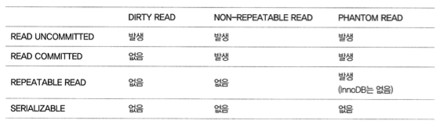
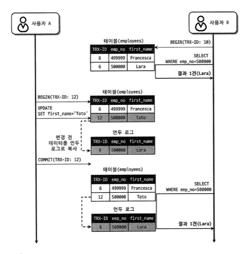
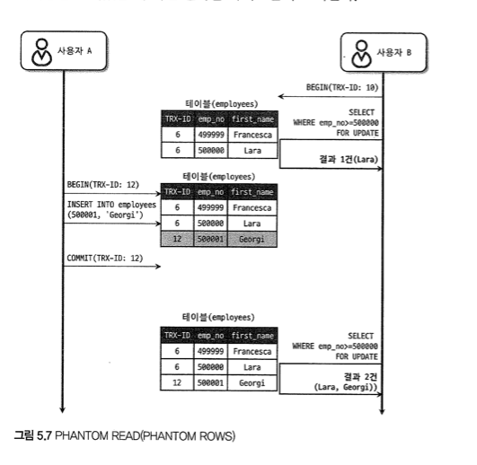

# 5. 트랜잭션과 잠금

- 트랜잭션은 **작업의 완전성을 보장**하는 것

- 잠금
  - 동시성을 제어하기 위함
- 트랜잭션
  - 데이터의 정합성을 보장

## 5.1 트랜잭션

쿼리의 수와 관계 없이 논리적인 작업 셋 자체가 100% 적용되거나, 아무것도 적용되지 않아야 한다.

쿼리가 한 개더라도 트랜잭션을 지원하지 않는 스토리지 엔진에서는 ROLLBACK 이 정상적으로 되지 않을 수 있다.

단 트랜잭션의 범위는 최소화해야!

## 5.2. MySQL 엔진의 잠금

MySQL 에서 사용되는 잠금은 스토리지 엔진 레벨과 MySQL 엔진 레벨로 나눌 수 있다.

- MySQL 엔진의 잠금
  - 모든 스토리지 엔진에 영향을 미침
- 스토리지 엔진 레벨의 잠금
  - 스토리지 엔진 간 상호 영향을 미치지 않는다.

MySQL  엔진에서는 테이블 데이터 동기화를 위한 테이블 락 이외에도 테이블 구조를 잠그는 메타데이터 락, 네임드 락 기능을 제공한다. 

### 5.2.1 글로벌 락

글로벌 락 : `FLUSH TABLES WITH READ LOCK` 으로 획득 가능

- 가장 범위가 큼
- 다른 세션에서 SELECT 를 제외한 대부분의 DDL 이나 DML 이 대기 상태로 남음
- 영향 범위는 MySQL 서버 전체. 테이블이나 데이터베이스가 다르더라도 동일한 영향을 미친다.

### 5.2.2 테이블 락

**개별 테이블 단위로 설정되는 잠금.** 명시적 혹은 묵시적으로 획득 가능

명시적으로 획득하려면  `LOCK TABLES table_name [READ|WRITE]`

특별한 상황이 아니라면 이또한 애플리케이션에서 사용할 필요가 없다.

묵시적 락은 MyISAM 이나 MEMORY 테이블에 데이터를 변경하는 쿼리를 실행하면 발생

### 5.2.3 네임드 락

네임드 락은 GET_LOCK() 함수를 통해 임의의 문자열에 대해 잠금을 설정한다.

**이 잠금의 특징은 테이블이나 레코드, AUTO_INCREMENT 같은 DB 객체가 아니다!**

단순 사용자가 지정한 문자열에 대해 획득하고 반납하는 잠금.

이를 통해 데드락을 예방할 수 있다. (동일 데이터를 변경하거나 참조하는 프로그램끼리 네임드 락을 적절히 걸어서 처리할 수 있을 것)

> 물론 같은 문자열을 참조하게 된다면 동일하게 네임드 락에 대한 데드락은 발생할 수 있을 것이다.

### 5.2.4 메타데이터 락

데이터베이스 객체의 이름이나 구조를 변경하는 경우에 획득하는 잠금

## 5.3 InnoDB 스토리지 엔진 잠금

스토리지 엔진 내부에서 레코드 기반의 잠금 방식을 탑재하고 있다.

### 5.3.1 InnoDB 스토리지 엔진의 잠금

잠금 정보가 상당히 작은 공간으로 관리되기 때문에 레코드 락이 페이지 락으로, 또는 테이블 락으로 레벨업 되는 경우는 없다.

상용 DBMS 와 다르게 InnoDB 스토리지 엔진은 레코드 락 뿐만 아니라 레코드와 레코드 사이의 간격을 잠그는 갭(GAP) 락이 존재한다.

#### 5.3.1.1 레코드 락

**InnoDB 스토리지 엔진은 레코드 자체가 아닌 인덱스의 레코드를 잠근다!**

인덱스가 하나도 없다면? 그래도 내부적으로 자동 생성된 클러스터 인덱스를 이용해 잠금을 설정한다.

#### 5.3.1.2 갭 락

갭락은 레코드와 바로 인접한 레코드 사이의 간격만을 잠그는 것.

**갭 락의 역할은 레코드와 레코드 사이의 간격에 새로운 레코드가 생성되는 것을 제어한다.**

이 자체보다는 넥스트 키 락의 일부로 사용되니 이어서 보자!

#### 5.3.1.3 넥스트 키 락

**레코드 락과 갭 락을 합쳐놓은 형태의 잠금**을 넥스트 키 락이라고 한다.

: 바이너리 로그에 기록되는 쿼리가 레플리카 서버에서 실행될 때 소스 서버에서 만들어낸 결과와 동일한 결과를 만들어내도록 보장하는 것이 주 목적

그런데 이 때문에 데드락이 발생하거나 다른 트랜잭션을 기다리게 만드는 일이 자주 발생. 
가능하다면 바이너리 로그 포맷을 ROW 형태로 바꿔서 넥스트 키 락이나 갭 락을 줄이는 것이 좋다.

#### 5.3.1.4 자동 증가 락 (AUTO_INCREMENT_LOCK)

auto increment 를 위해 사용하는 락.

auto increment 를 사용하는 순간만 락이 걸렸다가 즉시 해제된다.

5.1 이상 부터는 이 락의 작동 방식을 변경할 수도 있다.

### 5.3.2 인덱스와 잠금

InnoDB 의 락은 레코드를 잠그지 않고 인덱스를 잠그는 방식이다.

-> 변경해야 할 레코드를 찾기 위해 검색한 인덱스의 레코드를 모두 락을 건다.

예를 들어 index 가 컬럼 A 에만 있을 때 
`update table_name set A='update value' where A='before value' and B='something'`

이라는 업데이트 문에 대해서, 

- `where A='before value' and B='something'` 의 개수 : 100
- `` where A='before value' and B='something'` 의 개수 : 1

라고 하더라도 A 에만 인덱스가 있으면 100개의 레코드에 대해서 락을 잡는다. 

만약 인덱스가 없다면? 풀스캔을 하면서 update 한다. 

### 5.3.3 레코드 수준의 잠금 확인 및 해제

5.1 부터 레코드 잠금과 잠금 대기에 대한 조회가 가능하다.

## 5.4 MySQL 의 격리수준

InnoDB에서는 REPEATABLE READ 격리수준에서도 PHANTOM READ 가 발생하지 않는다.

### 5.4.1 Read Uncommited

commit 이나 롤백 여부에 관계없이 변경 내역이 다른 트랙잭션에서 보임

### 5.4.2 Read Commited

최소 권장되는 격리 수준. (오라클의 기본. 가장 많이 선택되는 격리 수준)

Dirty read 발생하지 않음.

하지만 같은 트랜잭션 내에서 다른 결과를 가져올 수 있다. (repeatable read 정합성 깨짐)

주의사항

트랜잭션 내에서 실행되는 select 문과 트랜잭션 없이 실행되는 select 문의 차이를 혼동하는 경우가 있다. 
read commited 에서는 별 차이가 없지만 , repeatable read 격리 수준에서는 select 쿼리 문도 트랜잭션 범위 내에서 동작한다.

### 5.4.3 Repeatable Read

MySQL InnoDB 스토리지 엔진에서 기본으로 사용하는 격리수준이다.

**바이너리 로그를 가진 MySQL 서버에서는 최소 이 격리수준을 사용한다. (????)**

Repeatable Read 와 Read Committed 의 차이는 undo 영역에 백업된 레코드의 여러 버전 가운데 몇번째 이전 버전까지 찾아들어가야 하느냐이다.

여기서 Phantom Read 현상이 발생할 수 있다.

select for update 를 통해서 쿼리를 가져올 때 결과가 서로 다른데, 
이는 select for update 하는 레코드에 쓰기 잠금을 걸어야 하는데, 언두 레코드 영역에는 잠금을 걸 수 없다. 
그래서 언두 영역의 변경 전 데이터를 가져오는 것이 아니라 현재 레코드의 값을 가져오게된다.

### 5.4.4 Serializable

가장 엄격한 격리 수준이지만 동시 처리 성능은 떨어짐.

읽기 작업도 공유 잠금을 획득하게 된다.

하지만 InnoDB스토리지 엔진에서는 갭 락과 넥스트 키 락 덕분에 Repeatable Read 격리 수준에서도 phantom read 가 발생하지 않는다!

