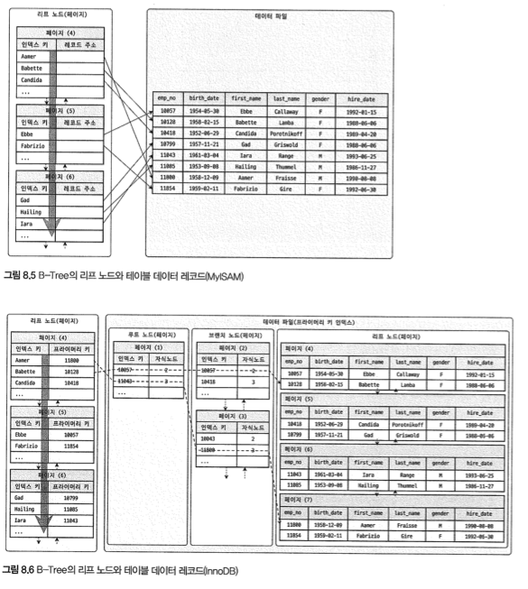
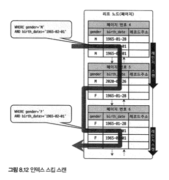
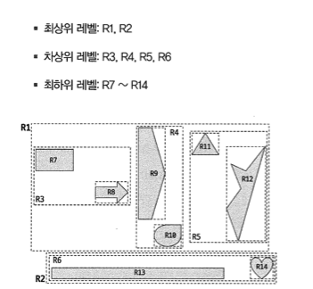

# 8. 인덱스


## 8.1 디스크 읽기 방식

디스크와 같은 기계 장치는 상당히 제한적으로 발전하는데, 
이에 따라 DB성능 튜닝은 어떻게 디스크 IO 를 줄이느냐가 관건.


### 8.1.1 HDD, SSD

디비 서버는 항상 디스크 장치가 병목이 된다. 따라서 HDD 를 대체하기 위해 SSD 가 많이 출시되고 있다.

SSD 가 HDD 에 비해 랜덤 IO 가 훨씬 빠르다.


### 8.1.2 랜덤 IO 와 순차 IO

- 순차 IO 는 3개의 페이지를 디스크에 기록하기 위해 시스템 콜을 1번 요청
- 랜덤 IO는 3개의 페이지를 디스크에 기록하기 위해 시스템 콜을 3번 요청

여러 번 쓰기 또는 읽기를 요청하는 랜덤 IO의 부하가 훨씬 크다. 

쿼리의 튜닝은 랜덤 IO 를 순차 IO 로 바꾸는 것이 목적이 아닌, 랜덤 IO 자체를 줄여야한다
-> 쿼리하는데 꼭 필요한 데이터만 읽도록 쿼리를 개선하는 것.


## 8.2 인덱스란

인덱스는 원하는 컬럼과 값을 key value 로 저장해두는 것.

- 데이터 저장 방식별로 구분하면
  - B-트리와 Hash 인덱스가 대표적. 
    이외에도 최근엔 Fractal Tree 인덱스나 다른 알고리즘 쓰는 DBMS 도 존재.

- 중복 허용 분류하면
  - 유니크 인덱스/논-유니크 인덱스
  - 유니크는 1건만 찾기에 찾으면 더이상 찾지 않아도 된다.


## 8.3 B-Tree  인덱스

B는 Binary 가 아닌 Balanced!

### 8.3.1 구조 및 특성

루트 노드, 브랜치, 리프 노드로 구성되어 있다.
리프 노드에는 실제 데이터 레코드를 찾기 위한 주솟값을 갖고 있음



MyISAM 과 다르게 InnoDB의 경우 PK 가 ROWID 역할을 하고 있다.

따라서 반드시 pk 를 저장하고 있는 B-Tree 검색이 한 번 더 필요하다!

### 8.3.2 B-Tree 인덱스 키 추가 및 삭제

- 저장될 때
  - 적절한 위치 검색, 결정되면 주소 정보를 B-Tree 에 저장
  - 리프노드가 꽉차면 리프  노드 분리하기 위해 상위 브랜치 노드까지 영향
  - 인덱스 추가로 인한 영향도 계산
    - 명확하게 답하려면 테이블 칼럼 수, 컬럼 크기, 특성 파악 필요
    - 대략적인 계산 방법은 테이블에 레코드를 추가하는 작업 비용을 1이라고 가정하면 
      해당 테이블의 인덱스에 키를 추가하는 작업 비용은 1.5
      - 인덱스가 하나도 없는 경우 작업 비용 1 
      - 인덱스가 3개있었을 때 1.5 * 3 + 1 = 5.5

- 삭제할 때
  - 리프 노드를 찾아서 삭제 마크만 한다
  - 삭제 마킹된 공간은 방치하거나 재활용
  - 마킹 작업 자체도 디스크 쓰기는 필요
  - 5.5 이상의 InnoDB는 지연처리 가능
- 변경
  - 키 값이 변경된 경우, 키값을 삭제하고 추가하는 형태로 처리
- 검색
  - 인덱스는 100% 일치 혹은 값의 앞부분이 일치할 때 사용 가능


### 8.3.3 B-Tree 인덱스 사용에 영향을 미치는 요소

**인덱스 키 값의 크기**

- InnoDB 엔진이 디스크에 데이터를 저장하는 기본 단위 : 페이지 or 블록
- 모든 읽고 쓰는 작업의 최소 단위
- 인덱스는 페이지 단위로 관리되며, 루트, 브랜치, 리프를 구분한 기준이 페이지 단위


**B-Tree 의 자식 노드의 개수**

- 인덱스 페이지 크기와 키 값의 크기에 따라 결정
- 페이지 크기는 기본값은 16kb 

인덱스 키가 16바이트, 자식 노드 주소 영역12바이트로 가정해보면, 
하나의 인덱스 페이지에는 585개의 자식 노드를 가질 수 있다. `(16 * 1024 / (16 + 12))`

인덱스 키가 32바이트로 커지면 한 페이지에는 372개의 노드가 들어갈 수 있다.

=> 키가 커지면 읽을 수 있는 노드 수가 작으므로 디스크 IO 수가 증가할 수밖에 없다.


**B-Tree 깊이**

깊이는 중요하지만 제어할 수 있는 방법은 없다.

B-Tree 깊이가 3인 경우, 키 값이 16바이트일 때 2억개의 키를 담을 수 있지만, 32바이트가 되면 5천만개로 줄어든다. 

즉 키 값은 가능하면 작게 만드는 것이 좋다. 


**선택도(Selectivity, Cardinality)**

모든 인덱스 키 값 가운데 유니크한 값의 수를 의미.

중복된 값이 많아질수록 카디널리티는 낮아진다. -> 카디널리티가 높아야 검색 대상이 줄어들기에 이득


**읽어야하는 레코드 건수**

인덱스 손익분기점은 20~25% 정도로 전체 레코드 사이즈와 비교해가면서 하는 것이 낫다.

이 값을 넘긴다면 힌트를 써서 풀스캔 하는 것이 낫다.


### 8.3.4 B-Tree 인덱스를 통한 데이터 읽기

인덱스를 이용해서 실제 레코드를 읽어내는 방법을 알아야 한다.


**인덱스 레인지 스캔**

가장 대표적인 접근 방식


**인덱스 풀 스캔**

인덱스의 처음부터 끝까지 모두 읽는 방식


**루스(Loose) 인덱스 스캔**

오라클의 인덱스 스킵 스캔과 비슷하다.

필요하지 않은 인덱스 키 값은 SKIP 한다.

```sql
select dept_no, MIN(emp_no)
from t
where dept_no between 'A' and 'D'
group by dept_no;
```

조건에 만족하지 않는 레코드는 무시하고 다음 레코드로 이동한다.

 루스 인덱스 스킵은 group by 작업을 처리하기 위해 인덱스를 쓰는 경우에만 적용할 수 있다.


**인덱스 스킵 스캔**

```sql
select gender, birth
from employees
where birth >= '1990-12-12';
```

gender, birth 에 index 가 있을 때는 위 쿼리를 효율적으로 이용할 수 없다. (인덱스 풀스캔 했을 것이다)




gender 컬럼은 enum 값이므로 옵티마이저는 내부적으로 gender 컬럼을 넣어서 비슷한 형태로 쿼리를 최적화하여 실행할 것이다.

물론 선행 컬럼의 유니크한 값의 개수가 적어야 한다.


### 8.3.5 다중 컬럼 인덱스

2개 이상 컬럼을 포함하는 인덱스


### 8.3.6 B-Tree 인덱스의 정렬 및 스캔 방향

인덱스를 생성할 때 정렬한 규칙에 따라 정렬되어 저장된다.

하지만 거꾸로 읽으면 된다.

- 인덱스의정렬
  - 5.7까지는 정렬 순서를 혼합하여 인덱스 생성이 불가능했음

- 인덱스 스캔 방향
  - 생성 방향과 무관. 거꾸로 읽으면 끝
- 내림차순 인덱스
  - 읽어보면 실제로는 약간 정순에 비해서 느리다.
    - 페이지 잠금이 인덱스 정순 스캔에 적합한 구조
    - 페이지 내에서 인덱스 레코드가 단방향으로 연결된 구조
  - 위의 두가지 이유 때문

### 8.3.7 B-Tree 인덱스의 가용성과 효율성

**비교 조건의 종류와 효율성**

비교작업의 범위를 좁힐 수 있도록 설계해야한다.


**인덱스의 가용성**

왼쪽값에 기준하여 오른쪽 값도 정렬되어 있다. 


**가용성과 효율성 판단**

- not equal, like(뒷부분 일치), 인덱스 컬럼 변경 등


## 8.4 R-Tree 인덱스

공간 인덱스는 R-Tree 인덱스 알고리즘을 사용하여 2차원의 데이터를 인덱싱하고 검색하는 목적의 인덱스.

2차원 공간 개념 값!

위치 기반의 서비스를 구현하는 방법은 여러가지 있지만 MySQL의 공간 확장을 이용하면 좋다.

- 공간 데이터를 저장할 수 있는 데이터 타입
- 공간 데이터 검색을 위한 공간 인덱스
- 공간 데이터의 연산 함수

공간 정보 검색을 위한 R-Tree 알고리즘의 이해를 위해 MBR 이라는 개념이  필요.

MBR : Minimum Bounding Rectangle 

해당 도형을 감싸는 최소 크기의 사각형.



위와 같은 MBR 을 3가지 레벨로 나누어서 볼 수 있다.

이것이 루트 노드, 브랜치, 리프로 나눠진다.


### 8.4.2 R-Tree 인덱스의 용도

위도 경도 좌표 뿐만 아니라 모든 좌표 시스템에 기반을 둔 정보에 대해서 모두 적용 가능.

도형의 MBR 포함 관계를 이용해 만들어진 인덱스로, 포함관계 비교하는 함수로 검색이 가능.

(사용자 위치로부터 5km 이내 검색)


## 8.5 전문(Full Text) 검색 인덱스

컬럼의 값이 1MB 까지 되더라도 전체를 쓰는 것이 아니라 일부만 잘라서 사용한다.

Full Text 검색에는 일반적인 용도의 B-Tree 를 사용할 수 없다.


...

## 8.6 함수 기반 인덱스

컬럼의 값을 변형해서 만들어진 값에 대해 인덱스를 구축해야할 때도 있을 때 사용

- 가상 컬럼을 이용한 인덱스
  - 새로운 컬럼 추가하는 것과 같은 효과가 있음
  - 테이블 구조가 변경되는 단점
- 함수를 이용한 인덱스
  - 계산된 결괏값의 검색을 빠르게 만들어줌
  - 따라서 조건절에 명시된 표현식을 그대로 써야함
    - `index ix_fullname((CONCAT(first_name, ' ', last_name)))`


## 8.7 멀티 밸류 인덱스

하나의 데이터 레코드가 여러 키 값을 가질 수 있는 형태.

JSON 데이터 타입을 지원하면서 저장된 elements 에 대한 인덱스를 쓰기 위함.


```sql
create table user(
  -- ...
  credit_info JSON,
  INDEX mx_creditscores((CAST(credit_info->'$.credit_scores' AS UNSIGNED ARRAY)))
)

insert into user values (..., '{"credit_scores": [100,200,300]}')
```

멀티 밸류 인덱스를 쓰기 위해선 일반적인 조건 방식이 아닌 다음 함수를 써야한다.

- member of()
- json_contains()
- json_overlaps()


## 클러스터링 인덱스


### 8.8.1 클러스터링 인덱스

- 테이블의 레코드를 PK 를 기준으로 묶어서 저장하는 형태로 구현
- 레코드의 저장 방식이라고 볼 수도 있다.
- 클러스터링 테이블과 동의어!


### 8.8.2 세컨더리 인덱스에 미치는 영향

세컨더리 인덱스가 실제 레코드가 저장된 구조를 가지고 있다면, 클러스터링 키가 변경될 때마다 데이터 레코드의 주소가 변경되어야하기 때문에, 세컨더리 인덱스는 해당 레코드가 저장된 주소가 아닌 PK 값을 갖고 잇다.

### 8.8.3 장단점

- 장점
  - 매우 빠름
  - 세컨더리 인덱스가 pk를 갖고 있기 때문에 인덱스만으로 처리될 수 있는 경우 많음
- 단점
  - 모든 세컨더리 인덱스가 클러스터링키를 가지므로 클러스터링 키 값이 클 경우 전체 인덱스 크기가 커짐
  - 세컨더리 인덱스를 통해 검색할 때 프라이머리 키로 다시 한 번 검색해야 하므로 처리 성능이 느림
  - insert 할 때 pk 에 의해 저장위치 결정되므로 느림
  - pk 변경 시 delete 하고 insert 작업으로 인해 느림


### 8.8.4 클러스터링 테이블 주의사항

- pk키가 커지면 세컨더리 인덱스도 자동으로 커짐
- pk는 AUTO-INCREMENT 보다 업무적인 컬럼으로 생성하는 것이 더 좋을 수 있다.
- PK는 반드시 정의해야한다. 그렇지 않으면 자동으로 추가한 컬럼이 생기는데 이는 사용자가 접근할 수 없다.


## 8.9 유니크 인덱스

- 일종의 제약 조건에 가까움
- 인덱스 없이 유니크 제약만 걸 수 없음
- null 값은 2개 이상 저장 가능 (null은 값이 아니므로)


### 8.9.1 유니크 인덱스와 세컨더리 인덱스 비교

- 인덱스 읽기
  - 유니크 인덱스가 무조건 빠르지 않다.
- 인덱스 쓰기
  - 중복 체크가 필용하므로 쓰기가 느릴 수 있다.
  - 쓰기할 때 잠금 때문에 데드락이 발생한다.

### 8.9.2 주의사항

똑같은 세컨더리 인덱스를 만들 필요는 없다. 


## 8.10 외래키

InnoDB 엔진에서만 생성 가능. 

외래키 설정하면 연관 테이블 컬럼에 인덱스까지 생성됨.

- 테이블 변경이 발생할 때 잠금 경합 발생
- 외래키와 연관 없는 컬럼의 변경은 잠금 경합 발생 없음


