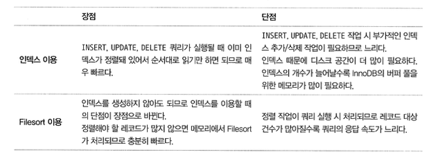

# 9. 옵티마이저와 힌트

### 9.1.1 쿼리 실행 절차

쿼리의 실행 과정

1. sql 문을 MySQL 서버가 이해할 수 있는 수준으로 분리 (SQL 파싱)
   - SQL 파서가 처리
2. SQL 파싱 정보를 확인하면서 어떤 테이블부터 읽고 어떤 인덱스 이용해 읽을지 선택
   - 불필요 조건 제거 및 복잡한 연산의 단순화
   - 여러 테이블의 조인이 있는 경우 어떤 순서로 테이블 읽을지 결정
   - 각 테이블에 사용된 조건과 인덱스 통계 정보를 이용해 사용할 인덱스 결정
   - 가져온 레코드들을 임시 테이블에 넣고 재가공해야하는지 결정
3. 2번째 단계에서 결정된 테이블의 읽기 순서나 선택된 인덱스를 이용해 스토리지 엔진으로부터 데이터를 가져온다.

여기서 2번째 단계가 옵티마이저가 처리한다.

3번은 수립된 실행 계획대로 스토리지 엔진에 레코드를 읽어오도록 요청, MySQL 엔진에서는 스토리지 엔진으로부터 받은 레코드를 조인하거나 정렬 작업을 수행.

### 9.1.2 옵티마이저의 종류

옵티마이저는 비용 기반 최적화와 규칙 기반 최적화 방법 2가지로 크게 나눌 수 있다.

- 규칙 기반 최적화
  - 레코드 건수, 선택도 등을 고려하지 않고 옵티마이저 내장된 우선 순위에 따라 실행 계획 수립
  - 같은 쿼리에 대해서 거의 항상 같은 실행 방법을 만든다.
  - 이제는 거의 쓰이지 않음
- 비용 기반 최적화
  - 쿼리를 처리하기 위한 여러 가능 방법을 만들고, 각 단위 작업의 비용 정보와 대상 테이블의 예측된 통계 정보를 이용해 실행 계획별 비용을 산출한다.
  - 산출도니 실행 방법별로 비용이 최소로 소요되는 처리 방식을 선택해 최종적으로 쿼리 실행.

## 9.2 기본 데이터 처리

### 9.2.1 풀 테이블 스캔과 풀 인덱스 스캔

풀 테이블 스캔 선택하는 경우

- 테이블의 레코드 건수가 너무 작아서 풀 테이블 스캔 하는 것이 더 빠른 경우 (일반적으로 테이블이 페이지 1개로 구성된 경우)
- where 절이나 on 절에 인덱스를 이용할 수 있는 적절한 조건이 없는 경우
- 인덱스 레인지 스캔을 사용할 수 있는 쿼리라고 하더라도 옵티마이저가 판단한 조건 일치 레코드 건수가 너무 많은 경우

InnoDB 스토리지 엔진은 특정 테이블의 연속된 데이터 페이지가 읽히면 백그라운드 스레드에 의해 리드 어헤드 작업이 자동으로 시작된다.

리드어헤드 : 어떤 영역의 데이터가 앞으로 필요해지리라는것을 예측해서 요청이 오기 전에 미리 디스크에서 읽어 InnoDB의 버퍼 풀에 가져다 두는 것.

### 9.2.2 병렬 처리

병렬 처리 - 하나의 쿼리를 여러 스레드가 작업을 나누어 동시에 처리한다.

### 9.2.3 order by 처리 (using filesort)

정렬 처리 방법은 인덱스 이용 하는 것과 filesort 를 이용할 수 있다.

#### 9.2.3.1 소트 버퍼

소트버퍼는 정렬이 필요할 대만 할당되며 정렬해야할 레코드의 크에 따라 가변적으로 증가

소트 버퍼를 위한 메모리 공간은 쿼리의 실행이 완료되면 시스템으로 즉시 반납.

정렬해야할 레코드 건수가 소트 버퍼 공간보다 클 경우, 정렬할 레코드를 여러 조각으로 나눠서 처리하는데, 이 과정에서 임시 저장을 위해 디스크를 사용한다.

#### 9.2.3.2 정렬 알고리즘

레코드 전체를 소트 버퍼에 담을지, 정렬 기준 컬럼만 담을지에 따라 싱글 패스와 투 패스 모드로 나눌 수 있다.

#### 9.2.3.3 정렬 처리 방법

- 인덱스 사용
  - 실행계획의 extra 컬럼 : 별도 표기 없음
- 조인에서 드라이빙 테이블만 정렬
  - 실행계획의 extra 컬럼 : using file sort
  - 조인을 실행하기 전에 1번 테이블의 레코드를 먼저 정렬한 다음 조인을 실행하는 것이 좋다.
  - 드라이빙 테이블은 where 절 등을 통해 작업량이 적은 테이블로 선택할 수 있다.
- 조인에서 조인 결과를 임시 테이블로 저장 후 정렬
  - 실행계획의 extra 컬럼 : using temporary; using filesort 
  - 하나의 테이블로부터 select 해서 정렬한다면 임시 테이블이 필요하지 않다.

### 9.2.4 group by 처리

group by 에 사용된 조건은 인덱스를 사용해서 처리될 수 없으므로 having 절을 튜닝할 필요는 없다.

### 9.2.5 distinct 처리

distinct 는 특정 컬럼을 유니크하게 가져오는 것이 아닌 레코드를 유니크하게 select 한다.

### 9.2.6 내부 임시 테이블 활용

## 9.3 고급 최적화

