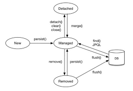

# 영속성 관리

> 자바 ORM 표준 JPA 프로그래밍 3장


## 엔티티 매니저 팩토리와 엔티티 매니저

DB 를 하나만 쓴다면 일반적으로는 애플리케이션에선 엔티티 매니저 팩토리는 1개만 생성한다. -> 매우 비싼 비용!

그리고, 엔티티 매니저 팩토리에서 엔티티 매니저(이하 em)를 생성한다!

엔티티 매니저 팩토리에서 em 을 생성 비용은 거의 들지 않음.

em factory -> 스레드 세이프하지만 em 은 safe 하지 않으므로 스레드 간 공유하지 않는다!


### 엔티티 매니저가 커넥션은 언제 맺어?

em 은 커넥션을 꼭 필요한 시점까지 얻지 않는다. -> 트랜잭션을 시작할 때 커넥션 획득

하이버네이트를 포함한 jpa 구현체는 emf 를 새성 시 커넥션 풀도 같이 생성하는데, J2SE에서의 방법이다.


## 영속성 컨텍스트란?

JPA 에서 가장 중요한 용어인 **영속성 컨텍스트**!

> 엔티티를 영구 저장하는 환경

### 엔티티의 생성 주기

- 비영속 : 영속성 컨텍스트와 전혀 무관
- 영속 : 영속성 컨텍스트에 저장됨
  - 엔티티 매니저를 통해 엔티티를 영속성 컨텍스트에 저장해야한다! (비영속 -> 영속으로!)
- 준영속 : 영속성 컨텍스트에 저장되었다가 분리됨
  - 영속성 컨텍스트가 관리하던 엔티티를 영속성 컨텍스트가 관리자히 않으면 준영속이 된다.
  - `em.detatch()`
  - 객체가 삭제되는 것이 아니라, 그냥 분리되는 상태!
- 삭제 : 삭제됨
  - 엔티티를 영속성 컨텍스트와 데이터베이스에서 삭제



### 영속성 컨텍스트의 특징

- 영속성 컨텍스트와 식별자 값
  - 영속 상태는 식별자 값이 반드시 있어야 한다!
- 영속성 컨텍스트와 데이터베이스 저장
  - 엔티티가 저장되는 순간은, 트랜잭션을 커밋하는 순간 
    영속성 컨텍스트에 새로 저장된 엔티티를 DB에 반영 (flush)

#### 장점이 뭔데?

- 1차 캐시
- 동일성 보장
- 트랜잭션을 지원하는 쓰기 지연
- 변경 감지
- 지연 로딩


#### 엔티티 조회

영속성 컨텍스트는 내부에 캐시를 가지고 있는데 이를 1차 캐시라 하며, 영속상태의 엔티티는 모두 여기에 저장!

(영속성 컨텍스트 내부의 map 에 키는 @id, 값은 엔티티 인스턴스)

1차 캐시에 있다면 DB에 질의하지 않고, 없다면 DB에 질의한다.

-> `em.find(~~)` 를 반복해서 호출해도 얻는 엔티티는 동일하다. (엔티티의 동일성)

#### 엔티티 등록

em 은 트랜잭션을 커밋하기 직전까지 내부 쿼리 저장소에 insert sql 을 모아둔다. 
그리고 커밋 할 때 한 번에 보낸다!

#### 엔티티 수정

수정의 방법은 변경 감지를 통해서 할 수 있다.

JPA 는 **엔티티를 영속성 컨텍스트에 보관할 때, 최초 상태를 복사해서 저장해두는 스냅샷을 갖고 있는다.** 
그리고 **플러시 시점에 스냅샷 <-> 엔티티를 비교**, 변경된 엔티티를 찾는다!

JPA 는 기본적으로 모든 컬럼을 업데이트 하는 형태로 진행되는데,
필드가 너무 많거나 저장되는 내용이 너무 크면 
수정된 데이터만 사용해서 동적으로 update sql 을 생성하는 전략을 선택하면 된다.(`@Dynamicupdate`  )

참고 ) `@DynamicInsert` : 데이터가 존재하는 필드(not null field)만으로 insert sql 을 동적으로 생성.


#### 엔티티 삭제

엔티티 삭제는 먼저 삭제 대상 엔티티를 조회, 영속성 컨텍스트로 관리하여 삭제한다. (쓰기 지연 sql 저장소에 등록된 이후 삭제됨)

그럼 엔티티 인스턴스는 재사용하지않고 GC 대상이 되도록 만든다.


## 플러시 (flush)

 영속성 컨텍스트의 변경 내용을 데이터베이스에 반용

1. 변경 감지가 동작해서 영속성 컨텍스트에 있는 모든 엔티티를 스냅샷과 비교, 수정된 엔티티를 찾고 수정 쿼리를 만들어 쓰기 지연 저장소에 등록
2. 쓰기 지연 저장소의 쿼리를 데이터베이스에 전송

플러시 하는 방법은?

- em.flush 직접 호출

  - 테스트나 다른 프레임워크와 JPA를 함께 쓰는 것이 아니라면 거의 사용하지 않는다.

- 트랜잭션 커밋시

- JPQL 쿼리 실행 시

  - 객체 지향 쿼리를 호출할 때도 실행된다. 

  - ```java
    em.persist(memberA);
    em.persist(memberB);
    em.persist(memberC);
    query = em.createQuery("select m from Member m", Member.class);
    ```

    - memberA ~ memberC 는 DB에 없고 영속성 컨텍스트에만 있기에 jpql 의 결과가 없을 수 있다. -> 이를 실행할 때 flush 이후 실행된다. -> memberA ~ memberC 검색 가능!


### 플러시 모드 옵션

모드를 직접 설정할 수도 있는데, 2가지 중 하나.

- FlushModeType.AUTO : 커밋이나 쿼리를 실행할 때 (default)
- FlushModeType.COMMIT : 커밋할 때만


## 준영속 & 병합

영속 상태의 엔티티가 영속성 컨텍스트에서 분리된 상태.

이걸 왜 관심을 가져야할까? 왜냐면 flush 이후의 객체는 준영속 상태이기 때문!

병합은 entity 의 식별자 값으로 영속성 컨텍스트를 조회하고, 없으면 DB 에서 조회한다. DB에도 없다면? 새로운 엔티티를 생성해서 병합


