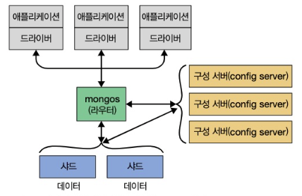

# 몽고 DB 소개

몽고 디비를 만든 주요 디자인 결정을 알아보자!

## 1.1 손쉬운 사용

도큐먼트 지향 데이터 베이스!

RDB 를 사용하지 않는 주된 이유는

- Scale Out 을 위해서!
- 행 개념 대신 유연한 모델인 도큐먼트를 사용
  - 내장 도큐먼트 + 배열 허용함으로써 복잡한 계층 관계를 하나의 레코드로 표현 가능
- 도큐먼트의 키와 값을 미리 정의하지 않는다
  - 고정된 스키마가 없다!
  - 쉽게 필드 추가/제거 가능
  - 개발 과정 반복할 수 있어서 속도 향상

## 1.2 확장 가능한 설계

애플리케이션의 데이터셋의 크기는 빠르게 증가.

➡ 확장이 매우 어려워지고 있다

몽고 DB는 scale out 을 염두에 두고 설계되었다.

도큐먼트 지향 데이터 모델은 여러 서버에 더 쉽게 분산해줄 수 있다!
도큐먼트를 자동으로 재분배 + 요청을 올바른 장비에 라우팅 
➡ 클러스터 내 데이터 양과 부하 조절

몽고 DB 클러스터의 토폴로지나 데이터베이스 연결의 다른 쪽 끝을 
단일 노드가 아닌 클러스터가 있는지를 애플리케이션에서 확인 가능! 

> ?

## 1.3 다양한 기능

DBMS 의 대부분 기능 가능!

- 인덱싱
  - 보조 인덱스를 지원하며, 고유/복합/공간정보/전문 인덱싱 기능도 제공
  - 중첩된 도큐먼트 및 배열 구조의 보조 인덱스 지원
- 집계
  - 데이터 처리 파이프라인 개념을 기반으로 집계 프레임워크를 제공
  - DB최적화를 최대한 활용하여 간단한 일련의 단계로 서버에서 데이터를 처리 -> 분석 엔진 구축 가능
- 특수한 컬렉션 유형
  - 로그같은 최신 데이터를 유지하고자 세션이나 고정 크기 컬렉션에 대해 ttl 지원
  - 기준 필터와 일치하는 도큐먼트에 한정된 부분 인덱스 지원
- 파일 스토리지
  - 큰 파일 / 파일 메타데이터를 편리하게 저장하는 프로토콜 지원

## 1.4 고성능

동시성과 처리량을 극대화하기 위해 **와이어드타이거 스토리지 엔진**에 **기회적 락**을 사용

➡암튼 요약하면 모든 측면에서 고성능을 유지하기 위해 설계됨!

관계형 시스템의 많은 기능을 포함하지만, RDB의 작업을 전부 하려는 것은 아니다.
일부 기능은 클라이언트에게 맡겨서 DB 서버는 간소화한다!

## 1.5 몽고 DB의 철학

확장성이 높으며 유연하고 빠른, 완전한 기능을 갖춘 데이터 스토리지를 만드는 일!

