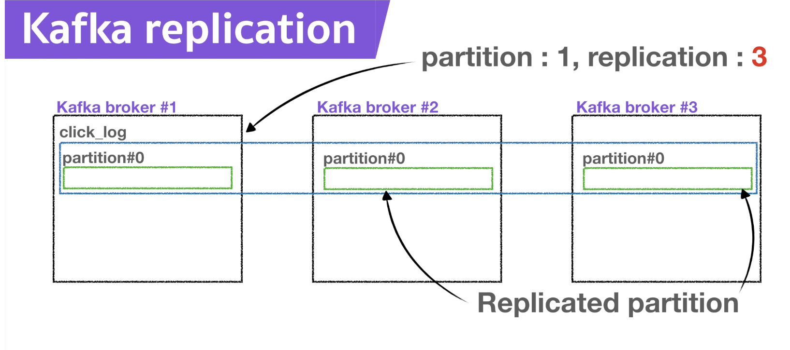
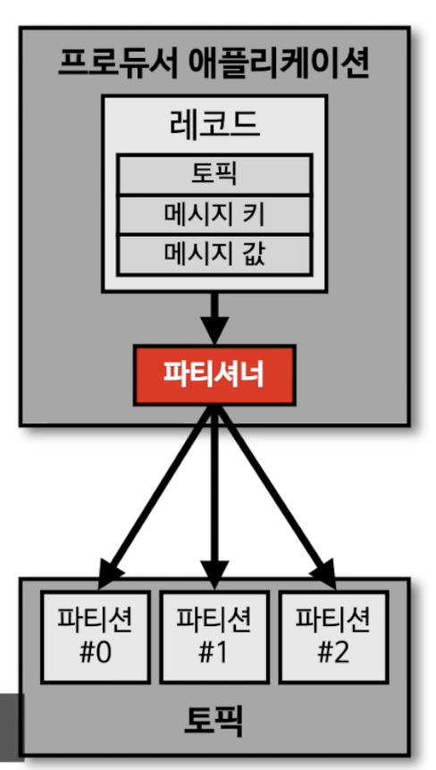
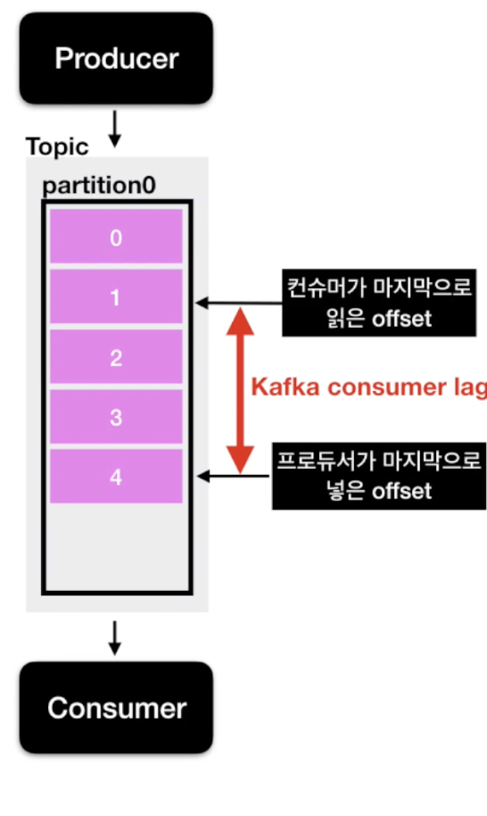

# Apache Kafka

카프카는 Source Application 과 Target Application 의 결합을 끊기 위해 나왔다.

카프카는 고가용성을 보장!

## 브로커, 복제(Replication), ISR(In-Sync-Replication)

카프카 브로커 : 카프카가 설치된 서버 단위로, 3개 이상의 브로커를 권장

파티션이 1개, 복제 1, 브로커 3대 -> 브로커 3대 중 1대에 해당 토픽의 정보가 저장된다.

replication? : 파티션의 복제

복제되지 않은 친구는 Leader Partition! 복제된 친구는 follower partition.

리더와 팔로워의 차이는?

프로듀서가 토픽을 파티션에 데이터를 전달할 때 전달받는 주체는 리더 파티션!

브로커에 데이터를 보내는 **프로듀서** 에는 ack 옵션이 있으며, 이를 통해 데이터 유실을 확인해볼 수 있다.

- ack 옵션
  - 0 : 프로듀서는 브로커에 데이터를 보내지만(요청) 응답을 받지 않는다. 
  - 1 : 정상적으로 받았는지 응답값을 받는다. 다만 복제가 되었는지는 알 수 없다.
  - all : 응답에 복제 성공 여부까지 받는다. 데이터 유실은 전혀 없다고 볼 수 있지만 속도가 현저히 느리다. 

그러면 Replication 이 많을수록 좋은가? No! 당연히 브로커의 리소스 사용량도 증가!
데이터량과 저장 시간을 고려하여 replication 개수를 고려하자.
(브로커 3개에 replication 3개를 추천!)

## 파티셔너 Partitioner

프로듀서의 중요 개념 중 하나!

프로듀서가 데이터를 보낼 때 어떤 파티션에 넣을지를 결정한다.

레코드의 메시지 키 혹은 값에 따라 파티션의 위치가 결정된다.

파티셔너를 설정하지 않는다면 UniformStickyPartitioner 로 동작.

메시지 키가 있는 경우, hash(메시지 키) = 파티션 번호

동일 메시지는 동일 파티션으로! -> 순서를 지켜서 처리할 수 있다.

메시지 키가 없다면 RR 방식, 그런데 배치로 모을 수 있는 최대한의 데이터를 모아 데이터를 보내 적절히 분배.

직접 개발한 파티셔너는?

Partitioner 인터페이스를 사용해서 커스텀할 수 있다.

10개의 파티션이 있다고 가정할 때, 8개에는 빠른 처리가 필요한 데이터를, 나머지 2개의 파티션에는 나머지 데이터를 보내는 식으로 데이터 처리 속도를 다르게 지정할 수도 있다.

## 컨슈머 랙 (Consumer Lag)

파티션에 데이터가 들어갈 때 데이터에는 offset 이라는 숫자가 붙는다.

파티션이 1개인 토픽에 프로듀서가 데이터를 넣을 경우, 0부터 차례대로 매겨진다.

프로듀서가 넣은 데이터가 넣은 offset, 컨슈머가 가져간 offset 의 차이 = consumer lag

lag 의 숫자를 통해 현재 해당 토픽에 대해 파이프라인으로 연계된 프로듀서, 컨슈머의 상태를 알 수 있으며, 
주로 컨슈머의 상태를 본다.

토픽에 여러 파티션이 존재할 경우 여러 lag 이 존재할 수 있다. 이중 가장 높은 값을 보게 된다.

## Burrow = 카프카 컨슈머 Lag 모니터링 필수요소

카프카 컨슈머 객체를 통해 현재 lag 정보도 가져올 수 있다. 

하지만 컨슈머 로직단에서 lag 수집은 위험!  -> lag 을 모니터링 하기 위해 burrow 라는 오픈소스를 만듦!

- BURROW 특징

  - 멀티 카프카 클러스터 지원
    - 2개 이상의 카프카 클러스터이더라도 burrow 1개만 연동한다면 클러스터에 붙은 컨슈머 lag 을 모두 확인

  - sliding window 통한 consumer 의 status 확인
    - error, warning, ok 등으로 표현.
    - consumer offset 이 일시적으로 증가한다면 warning, 데이터를 가져가지 않으면 error, ...

  - HTTP API 로 정의

## 카프카, 레빗엠큐, 레디스 큐의 차이점

각 플랫폼의 차이점을 보자.

메시징 플랫폼의 종류 

- 메시지 브로커 - *데이터를 보내고 처리하고 삭제한다*
  - **이벤트 브로커 역할 못함!**
  - 대규모 메시지 기반 미들웨어 아키텍처로 주로 사용됨
  - 메시지를 받아서 적절히 처리하고 나면 즉시 또는 짧은 시간 내에 삭제되는 구조
  - eg) 레디스, 레빗엠큐
- 이벤트 브로커 - *데이터를 보내고 처리하고 삭제하지 않는다*
  - **메시지 브로커 역할 할 수 있음!**
  - 이벤트(혹은 메시지) 레코드는 각각 1개만 보관, 인덱스를 통해 개별 액세스를 관리
  - 필요한 시간동안 이벤트 보존 가능
  - eg) 카프카, 키네시스

이벤트 브로커는 DB에 저장하듯 이벤트 브로커의 큐에 저장하는데 이점

- 딱 한 번 일어난 이벤트를 브로커에 저장함으로서 단일 진실 공급원
- 장애 발생 시 장애 발생 지점부터 재처리 가능
- 많은 양의 실시간 스트림 데이터를 효과적으로 처리 가능

