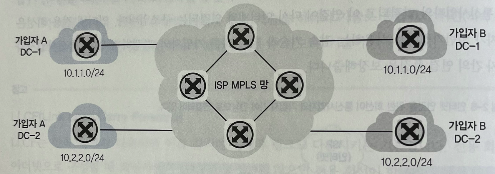

# VPN

: Virtual Private Network 의 약자.

전용선 통신은 아니지만, 가상으로 직접 연결한 것 같은 효과가 나도록 만들어주는 네트워크 기술.
논리적으로 직접 연결된 것처럼 만들어주는 통로를 터널이라고 하면, VPN을 이용하면 터널을 이용해 직접 연결된 것처럼 동작한다.

터널링 기법만 제공할 수 있다면 VPN이라고 할 수 있지만 터널링만 제공하는 기법은 자주 사용되지 않는다. 
VPN은 주로 공중망을 전용선과 같은 사설망처럼 사용하기 위해 도입하므로 강력한 보안을 제공해야 한다. 
그래서 IPSEC, SSL 과 같은 암호화 기법을 제공하는 프로토콜이 VPN에 주로 사용된다.

일반적으로 본사-지사 처럼 네트워크 대 네트워크 연결에는 IPSEC VPN 기술이 사용되고, 개인 사용자가 본사 네트워크로 접속하는 경우에는 SSLVPN 기술이 사용된다. 

아래는 IPSEC VPN 연결 구성도이다. VPN이 연결되는 양쪽에 모두 IPSEC VPN 을 지원하는 네트워크 장비가 필요하다.

아래는 SSL VPN 연결 구성도이다. 

### 참고 (전용회선과 VPN)

전용선으로 직접 연결할 때도 전용선을 통해 VPN을 추가 구성하기도 한다. 전용회선은 종단간 직접 연결하지만, 데이터는 그대로 흐르므로 암호화가 되지 않기에 암호화를 위해 VPN을 추가 구성하기도 한다.  (물론 어플리케이션 단에서 암호화해도 된다.)

## VPN 동작 방식

VPN 은 가상 네트워크를 만들어주는 장비로 터널링 기법을 사용한다. 
터널링 : 패킷을 터널링 프로토콜로 감싸 통신하는 기법
VPN이라고 부르는 프로토콜을 터널링에 보안을 위한 다양한 기술이 포함되어 있으며 IPSEC 과 SSL 을 가장 많이 쓴다. 

VPN 은 3가지 형태로 구현된다.

- host to host 통신 보호
  - 두 호스트간 직접 터널 연동하는 기법이지만 잘 사용하지 않는다.
- network to network 통신 보호
  - 본사-지사같은 특정 네트워크를 가진 두 종단을 연결하는 경우이며 IPSEC 프로토콜이 가장 많이 쓰인다.
- host 가 network 로 접근할 때 보호 
  - 모바일 사용자가 일반 인터넷망을 통해 사내망으로 연결하는 경우이며 IPSEC, SSL 프로토콜이 쓰인다.

## VPN 종류

### 통신 사업자 VPN 

전용선은 연결 거리가 늘어날수록 비용이 증가한다! 
=> 해외로 간다면 매우 비싸진다. 사용가능한 대역폭을 보장해주지만, 대역폭을 100% 쓰는 것은 아니다보니 낭비되는 비용이 클 수 있다. 

이런 비용을 줄이기 위해서 통신사업자가 직접 가입자를 구분할 수 있는 vpn 기술을 사용하는데 이게 **MPLS VPN**이다.

MPLS VPN 은 여러 가입자가 하나의 MPLS 망에 접속되지만 가입자를 수분할 수 있는 기술을 적용해 전용선처럼 사용할 수 있다.

여러 가입자가 하나의 망에 접속해 통신하므로 공용 회선을 함께 이용하게 되어 비용이 낮아진다.

MPLS VPN 기술은 가입자 입장에서는 기술적으로 특별히 고려할 것이 없으므로 일반 전용선 연결과 동일한 접속 기술을 사용하게 된다.

### 가입자 VPN

일반 사용자가 VPN을 사용한다면 대부분 가입자 VPN이다. 
일반 인터넷망을 이용해서 사용자가 직접 가상 전용 네트워크를 구성할 수 있다. 

