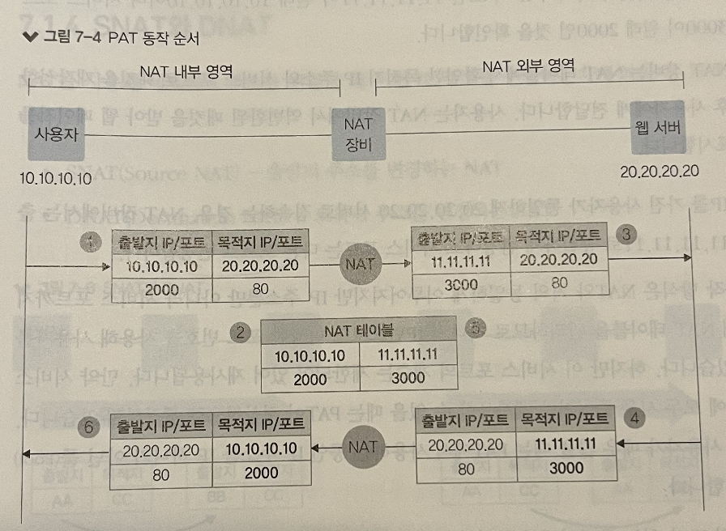
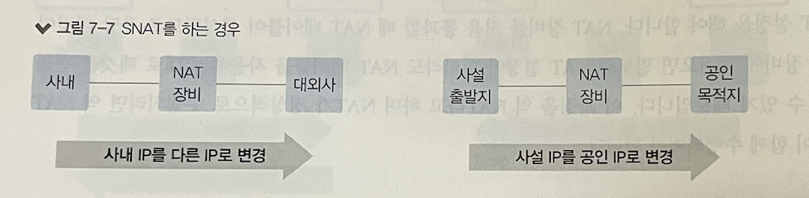
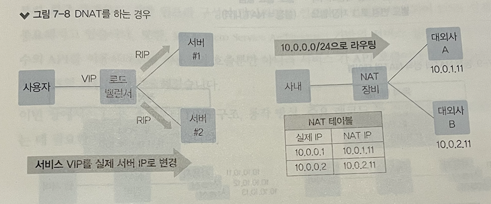

# 통신을 도와주는 네트워크 주요 기술

> IT엔지니어를 위한 네트워크 입문 7장 내용입니다.

## 1. NAT/PAT

`NAT (Network Address Translation)`: 네트워크 주소 변환

NAT 은 기본적으로 하나의 네트워크 주소에 다른 하나의 네트워크 주소로 변환하는 1:1 변환이 기본이지만, 
IP 주소가 고갈되는 문제를 해결하기 위해 1대다 변환하기도 한다.

`PAT(Port Address Translation)` 은 여러개의 IP 를 하나의 IP 로 변환하는 것. (NAT 으로 통칭하기도 하지만 구분해서 설명)

## 1.1. NAT/PAT 의 용도와 필요성

NAT 과 PAT 이 사용되는 이유

- IPv4 주소 고갈 문제의 솔루션
  - 갑자기 폭증한 IP 주소 요구를 수용하기 위함
  - 외부 공개 서비스는 공인 Ip를, 공개가 필요없는 서비스는 사설 IP 를 사용
- 보안을 강화하는 데 NAT 을 사용
  - IP주소는 네트워크에서 유일해야한다. 따라서 내부 IP를 다른 IP로 변환해 통신하면 외부에 사내 IP 주소 체계를 숨길 수 있다.
  - NAT 를 활용하여 내부 -> 외부는 허용, 외부 -> 내부는 막을 수 있다!
- IP주소 체계가 같은 두 개의 네트워크 간 통신을 허용한다
  - 사설 IP 를 이용해 다른 회사와 직접 연결한다면 사설 IP 주소가 충돌할 수 있다. (특히 대외계라 부르는 회사간 통신!)
    - 주로 전용 회선이나 암호화된 별도 네트워크를 이용해 통신
  - 출발지와 도착지를 한꺼번에 변환하는 **더블 NAT** 를 사용한다.
- 불필요한 설정 변경 줄일 수 있다 
  - IP 주소 변경이 이뤄질 때 DNS 서비스나 NAT 장비 설정은 변경해야하지만, 내부 서버나 PC 설정 변경을 최소화할 수 있다

물론 단점도 존재.네트워크 운영자 입장에선 장애 발생 시 문제 해결 힘들고, NAT 로 인한 오버헤드 등 존재한다.

## 1.2. NAT 동작 방식

## 1.3. PAT 동작 방식

PAT 동작 방식은 NAT 와 거의 동일하게 이뤄지지만, 서비스 포트까지 함께 변경하여 NAT 테이블 관리.

따라서 하나의 IP 만으로도 다양한 사용자 구분 가능!

## 1.4. SNAT 과 DNAT

- SNAT : 출발지 주소를 변경하는 NAT
- DNAT : 도착지 주소를 변경하는 NAT

SNAT, DNAT 은 트래픽이 출발하는 시작 지점을 기준으로 구분한다!

| 출발지   | 목적지   | NAT 구분 | 출발지 | 목적지 |
| -------- | -------- | -------- | ------ | ------ |
| **AA** → | CC       | SNAT     | **BB** | CC     |
| AA       | **CC** → | DNAT     | AA     | **DD** |

### 그럼 도대체 언제 쓸까?

#### SNAT

- 사설에서 공인으로 통신할 때 많이 사용.
  - 공인 IP 주소 목적지에서 다시 출발지로 응답 받으려면 공인 IP 로 응답 받아야 하니, 출발할 때 공인 IP 로 바꾸는 SNAT 필요.
- 보안상 이유
  - 내부 IP 주소가 아닌 별도로 다른 IP 로 전환함으로써 실제 IP 주소 숨김
- 로드 밸런서 구성에 따라
  - 출발지와 목적지 서버가 동일한 대역일 때 로드밸런서 구성에 따라 트래픽이 로드 밸런서를 거치지 않고 응답할 수 있어 SNAT 을 통해 응답 트래픽이 로드 밸런서를 거치게 만들 수 있다.

#### DNAT

- 로드밸런서
  - 사용자는 서비스 요청을 위해 로드밸런서에 설정된 서비스 Virtual IP 로 서비스를 요청, 
    로드 밸런서에서는 실제 IP로 DNAT 해서 내보낼 수 있다.
- 사내가 아닌 대외망과의 네트워크 구성
  - IP 중복 등의 이유로 신규 대외사 연동마다 라우팅을 개별 설정이 필요. 
    이 경우, 대외사의 IP를 특정 IP 대역으로 NAT 한다.

## 1.5. 동적 NAT 와 정적 NAT

정적 NAT : 출발지, 목적지의 IP 를 미리 매핑해 고정해놓은 NAT

동적 NAT : 출발지나 목적지가 사전에 정해지지 않고 NAT 를 수행할 때 IP 를 동적으로 변경

동적 NAT 는 출발지와 목적지 모두 정의된 것이 아닌 다수의 IP 풀에서 정해지므로 최소한 목적지나 출발지 둘 중 한 곳이 다수의 IP 로 구성된 IP 풀이나 레인지로 설정되어 있다.

NAT 테이블이 일정 시간동안 통신이 없으면 사라지므로 서비스 흐름을 고려하여 NAT 설정을 적용해야 한다.